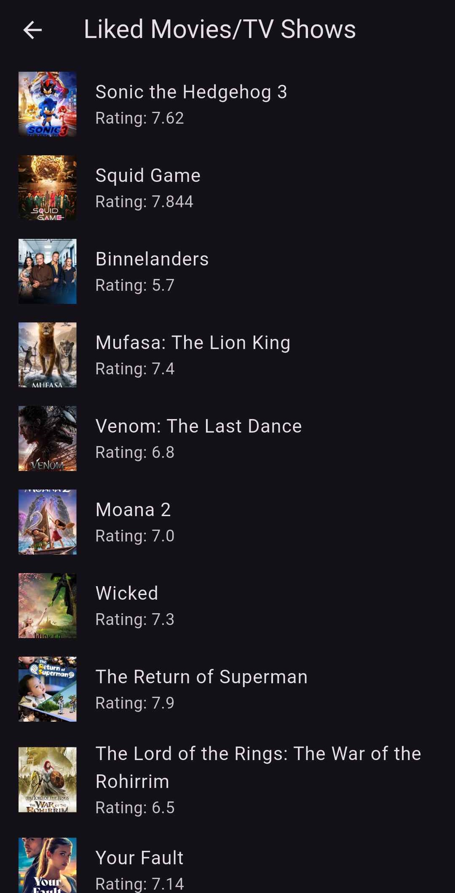

# Movie and TV Show Swiper App

This is a Flutter app that allows users to swipe through popular movies and TV shows, similar to the Tinder app. The app fetches movie and TV show data from the [TMDb API](https://www.themoviedb.org/) and displays them in a swipeable interface. Users can like movies and TV shows, and the liked items are saved and link to their respective TMDb pages.

## Features

- Swipe through movie and TV show recommendations
- Like movies and TV shows
- Save liked movies and TV shows in a list
- View more details about each movie or TV show on TMDb website

## Screenshots




## Getting Started

To get started with this project, follow the steps below:

### Prerequisites

- Install [Flutter](https://flutter.dev/docs/get-started/install)
- Set up an IDE like [VS Code](https://code.visualstudio.com/) or [Android Studio](https://developer.android.com/studio)

### Clone the repository

```bash
git clone https://github.com/yourusername/movie-swiper-app.git
cd movie-swiper-app
```

### Install dependencies

```bash
flutter pub get
```

### Set up the TMDb API

1. Sign up for a TMDb API key at [TMDb API](https://www.themoviedb.org/settings/api).
2. Add the API key in your `lib/config.dart` or wherever you handle your API configuration.

### Run the app

```bash
flutter run
```

## Dependencies

- `flutter_card_swiper`: For the swipeable card UI.
- `url_launcher`: To open TMDb pages in the browser.
- `tmdb_api`: A wrapper to interact with the TMDb API.
- `flutter_launcher_icons`: Easy to use App Icons.

---

Feel free to open issues or contribute to the project!
